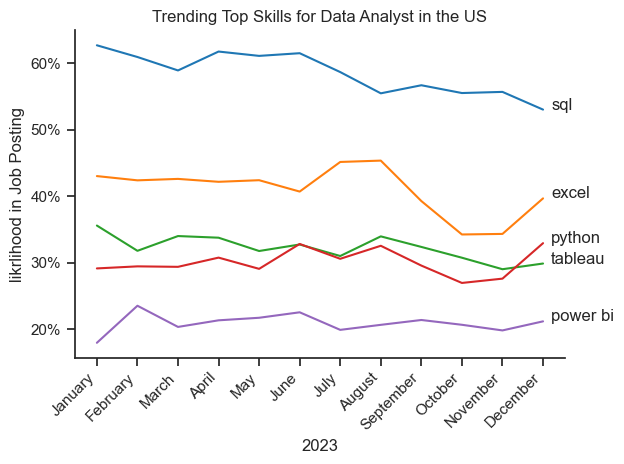
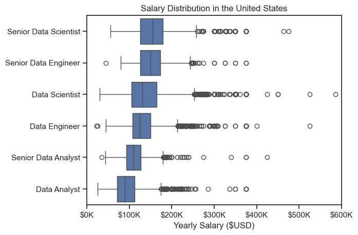

# The Analysis

## 1. What are the most demanded skills for the top 3 most popular data roles?

To find the most demanded skills for the top 3 most popular data roles. I filtered out those positions by which one were the most popular, and hot the top 5 skills for these top 3 roles. This query highlights the most popular job titles and their top skills, showing which skills I should pay attention to depending on the role I'm targeting.

View my notebook with detailed steps here: [2_Skills_Count.ipynb](2_Skills_Count.ipynb)

### Visualize Data

```python
fig, ax = plt.subplots(len(job_titles), 1)

sns.set_theme(style="ticks")

for i, job_title in enumerate(job_titles):
    df_plot = df_skill_perc[df_skill_perc["job_title_short"] == job_title].head(5)
    sns.barplot(data=df_plot, x="skill_percent", y="job_skills", ax=ax[i], hue="skill_count", palette="dark:b_r")
    ax[i].set_title(job_title)
    ax[i].set_xlabel("")
    ax[i].set_ylabel("")
    ax[i].set_xlim(0, 78)
    ax[i].legend().set_visible(False)

    for n, v in enumerate(df_plot["skill_percent"]):
        ax[i].text(v + 1, n, f"{int(v)}%", va="center")

    if i != len(job_titles) - 1:
        ax[i].set_xticks([])
fig.suptitle("Likelihood of Skills Requested in US Job Postings", fontsize=15)
plt.tight_layout(h_pad=0.5)
plt.show()
```

### Result


### Insights

- Python is a versatile skill, highly demanded across all three roles, but most prominently for Data Scientists (72%) and Data Engineers (65%).
- SQL is the most requested skill for Data Analyst and Data Scientists, with it in over half of the job postings for both roles. For Data Engineers, Python is the most sought-after skill, appearing in 68% of job postings.
- Data Engineers require more specialized technical skills (AWS, Azure, Spark) compared to Data Analysts and Data Scientists who are expected to be proficient in more general data management and analysis tools (Excel, Tableau)

# The Analysis

## 2. How are in-demand skills trending for Data Analysts?

### Visualize Data

```python

df_da_us = df[
    (df["job_title"] == "Data Analyst")
    &
    (df["job_country"] == "United States")
    ].copy()

df_da_us["job_month_no"] = df_da_us["job_posted_date"].dt.month
df_da_us["month_name"] = df_da_us["job_posted_date"].dt.month_name()

df_da_us_explode = df_da_us.explode("job_skills")

df_da_us_pivot = df_da_us_explode.pivot_table(
    index=["job_month_no", "month_name"],
    values="job_title",
    columns="job_skills",
    aggfunc="size",
    fill_value=0
)
df_da_us_pivot = df_da_us_pivot.reset_index()
df_da_us_pivot = df_da_us_pivot.set_index("month_name")
df_da_us_pivot.loc["total"] = df_da_us_pivot.sum()
df_da_us_pivot = df_da_us_pivot[
    df_da_us_pivot
    .loc["total"]
    .sort_values(ascending=False)
    .index
    ]

df_da_us_pivot = df_da_us_pivot.drop("total")

da_total = df_da_us.groupby("month_name").size()
df_da_us_percent = df_da_us_pivot.div(da_total/100, axis=0).reindex(df_da_us_pivot.index)

df_plot = df_da_us_percent.iloc[:, :5]

sns.lineplot(data=df_plot, dashes=False, palette="tab10")
sns.set_theme(style="ticks")
sns.despine()

plt.title("Trending Top Skills for Data Analyst in the US")
plt.ylabel("likrlihood in Job Posting")
plt.xlabel("2023")
plt.xticks(rotation=45, ha="right")
plt.legend().remove()

from matplotlib.ticker import PercentFormatter
ax = plt.gca()
ax.yaxis.set_major_formatter(PercentFormatter(decimals=0))

for i in range(5):
    plt.text(11.2, df_plot.iloc[-1, i], df_plot.columns[i])

plt.tight_layout()
plt.show()

```

### Result



*Bar graph visualizing the trending top skills for data analysts in the US in 2023*

### Insights

- SQL remains the most consistency demanded skill throughtout the year, although it shows a gradual decrease in demand.
- Excel experienced a significant increase in demand starting around September, surpassing both Python and Tableau by the end of the year.
- Both Python and Tableau show relatively stable demand throughout the year with some fluctuations but remain essential skills for data analysts. While Power BI is less demanded compared to the other top-tier skills, it remained remarkably stable throughout the year, consistently hovering around the 20% mark with a slight peak in demand during the mid-year months.

# The Analyst

## 3. How well do jobs and skills pay for Data Analysts?

### Salary Analysis

#### Visualize Data

```python

df_us = df[df["job_country"] == "United States"].dropna(subset="salary_year_avg")

job_titles = df_us["job_title_short"].value_counts().index[:6].tolist()

df_us_top6 = df_us[
    df_us["job_title_short"]
    .isin(job_titles)
    ]

job_order = df_us_top6.groupby("job_title_short")["salary_year_avg"].median().sort_values(ascending=False).index

sns.boxplot(data=df_us_top6, x="salary_year_avg", y="job_title_short", order=job_order)
sns.set_theme(style="ticks")

plt.title("Salary Distribution in the United States")
plt.xlabel("Yearly Salary ($USD)")
plt.ylabel("")
plt.xlim(0,600000)

ticks_x = plt.FuncFormatter(lambda y, pos: f"${int(y/1000)}K")
plt.gca().xaxis.set_major_formatter(ticks_x)
plt.show()

```



*Box plot visualizing the salary distributions for the top 6 data job titles*