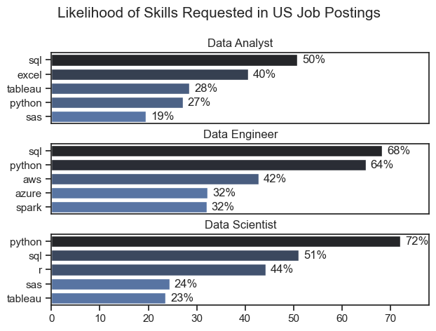

# Data Career Skills Analysis

## Project Overview

This section investigates the technical requirements for the three most prominent professions in the data industry. By isolating high-demand roles and extracting their top five essential skills, this analysis provides a strategic roadmap for skill acquisition based on specific career objectives. It serves as a guide for prioritizing the most relevant tools in a competitive job market.

View my notebook with detailed steps here: [2_Skills_Count.ipynb](Project_for_da/2_Skills_Count.ipynb)

## Visualizing the Demand

The following Python code utilizes Matplotlib and Seaborn to generate a comparative analysis of skill frequency across different data roles:

```python
fig, ax = plt.subplots(len(job_titles), 1)

sns.set_theme(style="ticks")

for i, job_title in enumerate(job_titles):
    df_plot = df_skill_perc[df_skill_perc["job_title_short"] == job_title].head(5)
    sns.barplot(data=df_plot, x="skill_percent", y="job_skills", ax=ax[i], hue="skill_count", palette="dark:b_r")
    ax[i].set_title(job_title)
    ax[i].set_xlabel("")
    ax[i].set_ylabel("")
    ax[i].set_xlim(0, 78)
    ax[i].legend().set_visible(False)

    for n, v in enumerate(df_plot["skill_percent"]):
        ax[i].text(v + 1, n, f"{int(v)}%", va="center")

    if i != len(job_titles) - 1:
        ax[i].set_xticks([])
fig.suptitle("Likelihood of Skills Requested in US Job Postings", fontsize=15)
plt.tight_layout(h_pad=0.5)
plt.show()
```

### Result



### Insights


- The Ubiquity of Python: Python stands as the most versatile asset, showing significant demand across all three roles, with a peak presence in Data Science (72%) and Data Engineering (65%).

- SQL vs. Python Priority: While SQL is the primary requirement for Data Analysts and Data Scientists (appearing in over 50% of postings), the Data Engineering path prioritizes Python, which is requested in 68% of job listings.

- Specialization Trends: There is a distinct technological divide; Data Engineering demands specialized infrastructure skills such as AWS, Azure, and Spark. In contrast, Analysts and Scientists are expected to master broader data management and visualization tools like Excel and Tableau.