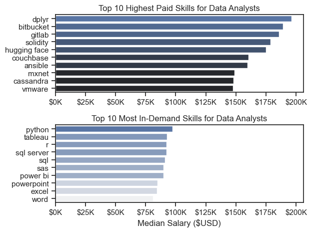
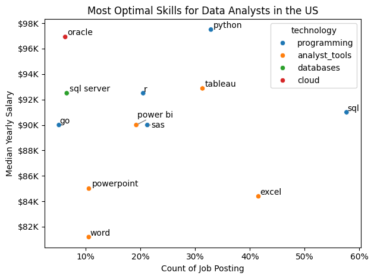

# The Analysis

## 1. What are the most demanded skills for the top 3 most popular data roles?

To find the most demanded skills for the top 3 most popular data roles. I filtered out those positions by which one were the most popular, and hot the top 5 skills for these top 3 roles. This query highlights the most popular job titles and their top skills, showing which skills I should pay attention to depending on the role I'm targeting.

View my notebook with detailed steps here: [2_Skills_Count.ipynb](2_Skills_Count.ipynb)

### Visualize Data

```python
fig, ax = plt.subplots(len(job_titles), 1)

sns.set_theme(style="ticks")

for i, job_title in enumerate(job_titles):
    df_plot = df_skill_perc[df_skill_perc["job_title_short"] == job_title].head(5)
    sns.barplot(data=df_plot, x="skill_percent", y="job_skills", ax=ax[i], hue="skill_count", palette="dark:b_r")
    ax[i].set_title(job_title)
    ax[i].set_xlabel("")
    ax[i].set_ylabel("")
    ax[i].set_xlim(0, 78)
    ax[i].legend().set_visible(False)

    for n, v in enumerate(df_plot["skill_percent"]):
        ax[i].text(v + 1, n, f"{int(v)}%", va="center")

    if i != len(job_titles) - 1:
        ax[i].set_xticks([])
fig.suptitle("Likelihood of Skills Requested in US Job Postings", fontsize=15)
plt.tight_layout(h_pad=0.5)
plt.show()
```

### Result


### Insights

- Python is a versatile skill, highly demanded across all three roles, but most prominently for Data Scientists (72%) and Data Engineers (65%).
- SQL is the most requested skill for Data Analyst and Data Scientists, with it in over half of the job postings for both roles. For Data Engineers, Python is the most sought-after skill, appearing in 68% of job postings.
- Data Engineers require more specialized technical skills (AWS, Azure, Spark) compared to Data Analysts and Data Scientists who are expected to be proficient in more general data management and analysis tools (Excel, Tableau)

# The Analysis

## 2. How are in-demand skills trending for Data Analysts?

View my notebook with detailed steps here: [3_Skills_Trend.ipynb](3_Skills_Trend.ipynb)
### Visualize Data

```python

sns.lineplot(data=df_plot, dashes=False, palette="tab10")
sns.set_theme(style="ticks")
sns.despine()

plt.title("Trending Top Skills for Data Analyst in the US")
plt.ylabel("likrlihood in Job Posting")
plt.xlabel("2023")
plt.xticks(rotation=45, ha="right")
plt.legend().remove()

from matplotlib.ticker import PercentFormatter
ax = plt.gca()
ax.yaxis.set_major_formatter(PercentFormatter(decimals=0))

for i in range(5):
    plt.text(11.2, df_plot.iloc[-1, i], df_plot.columns[i])

plt.tight_layout()
plt.show()

```

### Result


*Bar graph visualizing the trending top skills for data analysts in the US in 2023*

### Insights

- SQL remains the most consistency demanded skill throughtout the year, although it shows a gradual decrease in demand.
- Excel experienced a significant increase in demand starting around September, surpassing both Python and Tableau by the end of the year.
- Both Python and Tableau show relatively stable demand throughout the year with some fluctuations but remain essential skills for data analysts. While Power BI is less demanded compared to the other top-tier skills, it remained remarkably stable throughout the year, consistently hovering around the 20% mark with a slight peak in demand during the mid-year months.

# The Analyst

## 3. How well do jobs and skills pay for Data Analysts?

View my notebook with detailed steps here: [4_Salary_Analysis.ipynb](4_Salary_Analysis.ipynb)
### Salary Analysis

#### Visualize Data

```python

sns.boxplot(data=df_us_top6, x="salary_year_avg", y="job_title_short", order=job_order)
sns.set_theme(style="ticks")

plt.title("Salary Distribution in the United States")
plt.xlabel("Yearly Salary ($USD)")
plt.ylabel("")
plt.xlim(0,600000)

ticks_x = plt.FuncFormatter(lambda y, pos: f"${int(y/1000)}K")
plt.gca().xaxis.set_major_formatter(ticks_x)
plt.show()

```
### Result


*Box plot visualizing the salary distributions for the top 6 data job titles*

### Insight

- Role Hierarchy: There is a clear salary hierarchy among data roles. Data Scientists and Data Engineers tend to command higher median salaries than Data Analysts, reflecting the increased technical complexity or specialized engineering requirements of those positions.

- Seniority Premium: Senior roles, such as Senior Data Scientist and Senior Data Analyst, show significantly higher median salaries and wider interquartile ranges, indicating that experience is a primary driver for salary growth in the US market.

- Wide Salary Ranges: Most roles exhibit a broad distribution of salaries (indicated by the whiskers and outliers), suggesting that factors beyond job title—such as company size, industry, and specific geographic location—heavily influence individual compensation.
### Highest Paid & Most Demanded Skills for Data Analysts

#### Visualize Data

```python

fig, ax = plt.subplots(2,1)

sns.set_theme(style="ticks")

sns.barplot(data=df_da_top_pay, x="median", y=df_da_top_pay.index, hue="median", ax=ax[0], palette="dark:b")
ax[0].legend().remove()
ax[0].set_title("Top 10 Highest Paid Skills for Data Analysts")
ax[0].set_ylabel("")
ax[0].set_xlabel("")
ax[0].xaxis.set_major_formatter(plt.FuncFormatter(lambda x, _: f"${int(x/1000)}K"))

sns.barplot(data=df_da_skills, x="median", y=df_da_skills.index, hue="median", ax=ax[1], palette="light:b")
ax[1].legend().remove()

ax[1].set_title("Top 10 Most In-Demand Skills for Data Analysts")
ax[1].set_ylabel("")
ax[1].set_xlabel("Median Salary ($USD)")
ax[1].set_xlim(ax[0].get_xlim())
ax[1].xaxis.set_major_formatter(plt.FuncFormatter(lambda x, _: f"${int(x/1000)}K"))

plt.tight_layout()

```
### Result



### Insight

- The "Niche" Premium: The Highest Paid Skills for Data Analysts are often niche or specialized tools (e.g., Cloud tools or Big Data technologies) that may not appear in every job posting but command a significant salary premium due to their scarcity.

- Demand vs. Compensation: There is a notable gap between the most in-demand skills and the highest-paying ones. While SQL and Excel are the most frequently requested, their median salaries are generally lower than more specialized programming languages or advanced analytics platforms.

- Strategic Learning: To maximize earning potential as a Data Analyst, it is beneficial to move beyond foundational tools (SQL/Excel) and acquire proficiency in high-paying technical skills like Python or specific Cloud-based data platforms which bridge the gap between high demand and high pay.

# The Analysis

## 4. What are the most optimal skills for Data Analysts?

This section explores the intersection of skill frequency in job postings and their associated median yearly salaries. We define "High Demand" as skills appearing in more than 5% of all Data Analyst job postings in the United States.

View my notebook with detailed steps here: [5_Optimal_Skills.ipynb](5_Optimal_Skills.ipynb)

### Visualize Data

```python
df_plot = df_da_skill_high_demand.merge(df_technology, left_on="job_skills", right_on="skills")

from matplotlib.ticker import PercentFormatter
#df_plot.plot(kind="scatter", x="skill_percent", y="median_salary")
sns.scatterplot(
    data=df_plot,
    x="skill_percent",
    y="median_salary",
    hue="technology"
)
text = []
for i, txt in enumerate(df_da_skill_high_demand.index):
    text.append(plt.text(df_da_skill_high_demand["skill_percent"].iloc[i], df_da_skill_high_demand["median_salary"].iloc[i], txt))

adjust_text(text, arrowprops=dict(arrowstyle="->", color="gray"))

plt.xlabel("Count of Job Posting")
plt.ylabel("Median Yearly Salary")
plt.title(f"Most Optimal Skills for Data Analysts in the US")

ax = plt.gca()
ax.yaxis.set_major_formatter(plt.FuncFormatter(lambda y, pos: f"${int(y/1000)}K"))
ax.xaxis.set_major_formatter(PercentFormatter(decimals=0))
plt.tight_layout()
plt.show()
```
### Result



*Scatter plot visualizing the relationship between skill demand (percentage) and median salary for Data Analysts.*

### Insights

- The "Optimal" Zone: Skills like Python, Tableau, and R sit in a sweet spot with relatively high demand (15–30%) and high median salaries (around $100K). These are high-value targets for specialization.

- Foundational Skills: SQL and Excel lead in total demand, appearing in approximately 40–50% of job postings. While they are essential for landing a role, their median salaries are slightly lower (around $85K–$95K) compared to more specialized programming or visualization tools.

- Technical Clustering: Many "optimal" skills fall under programming and analyst tools (e.g., Python and SAS), highlighting the shift toward more technical, code-based data analysis in the current market.

- Market Entry: For those entering the field, mastering SQL and Excel provides the highest likelihood of finding a job, while adding Python or Tableau significantly increases earning potential.